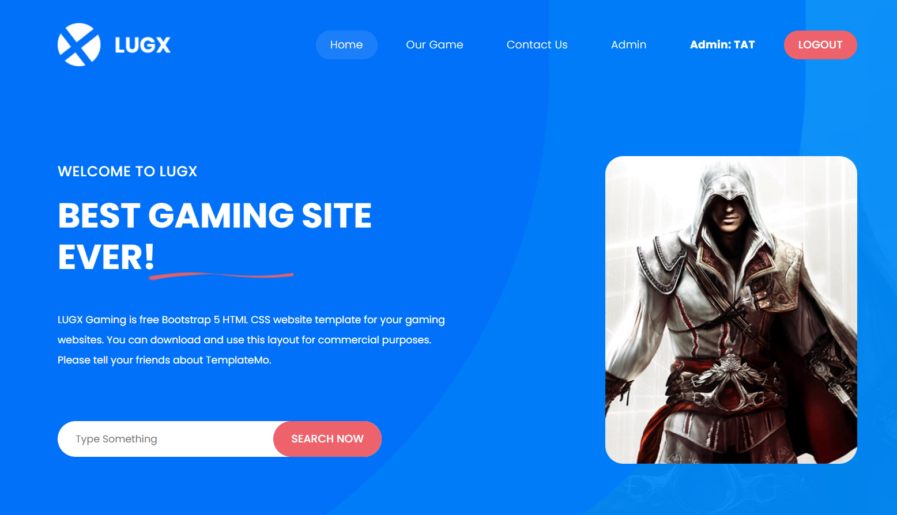
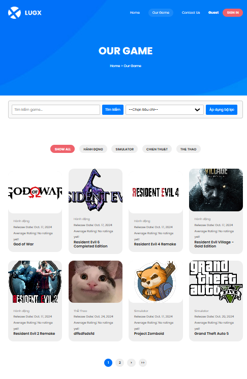
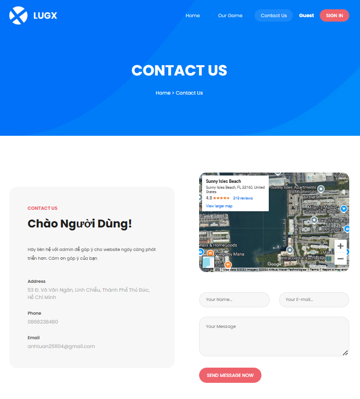
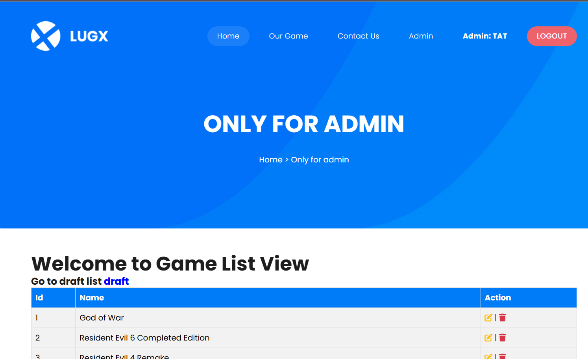

# Project-Web-Game
<h2 align="center">Hello 👋, I'm Tuan</h2>

  I'm a student at <a href="https://el.tdc.edu.vn/" target="_blank">Thu Duc College of Technology (TDC)</a>.

 

## 📫 How to Reach Me

   
   
  

## 🛠️ Skills

  
  
  
  
  
  
  
  

## Introduce the project:

Dự án của tôi là dự án làm về một trang web nơi mà người dùng có thể chia sẽ những gì bản thân suy nghĩ về con game ưa thích và tải những game mà bản thân muốn mà không thông qua các phần mềm thứ 3 và mất phí để chơi game

## Features:
- Chú thích User: người dùng đã tạo tài khoản, Admin: tài khoản được thêm sẵn của admin và chỉ admin mới tạo được tài khoản cho admin, Guest: người dùng không tạo tài khoản 
- Đăng nhập, đăng ký bằng tài khoản google
- Quản lý thêm,xóa,sửa thông tin đăng game - sử dụng bởi Admin
- Quản lý duyệt thông tin đăng game - sử dụng bởi Admin
- Quản lý thêm,xóa thông tin tài khoản - sử dụng bởi Admin
- Quản lý thêm,xóa,sửa thông tin danh mục - sử dụng bởi Admin
- Quản lý thêm,xóa,sửa thông tin nhà phát triển - sử dụng bởi Admin
- Xem thông tin game và tải game - sử dụng bởi User,Admin
- Xem thông tin game - sử dụng bởi Guest
- Quản lý bình luận và thích bình luận - sử dụng bởi Admin
- Bình luận bài viết và thích bình luận - sử dụng bởi User
- Bộ lọc với tìm kiếm nâng cao và phân trang
- Đăng ký tài khoản VIP(không bị quảng cáo khi tải game) - sử dụng bởi User
- Duyệt đăng ký tài khoản VIP cho User - sử dụng bởi Admin
- Quảng cáo khi ấn tải game - sử dụng bởi User
- Góp ý đến Admin qua Contact Us để góp ý gửi thông báo qua Email cho User - sử dụng bởi User,Guest(phải dùng Email chính xác mới thấy thông báo)

## Installation guide:

Đây là các module cần thiết để khởi chạy dự án

- pip install Django
- pip install Faker
- pip install bcrypt
- pip install django[argon2] 
- pip install Pillow
- pip install django-environ
- pip install django-ckeditor-5
- pip install django-allauth
- pip install django_extensions
- pip install django_requests
- pip install jwt
- pip install social_auth_app_django

## User guide:

Để xem và sử dụng tất cả các chức năng của trang web có thể dùng tài khoản admin để sử dụng Account: TAT - Password: 1

User cũng có thể tự tạo tài khoản và trải nghiệm

Trang web cũng được đăng lên Pythonanywhere: <a href="https://tat25.pythonanywhere.com/ProjectWebGame/index/" alt="Web" target="_blank">ProjectWebGame</a>

## Project Demo:
- Trang Chính:

- Trang hiện tất cả các bài viết đăng game:

- Trang góp ý với quản trị viên:

- Trang quản lý thông tin:

